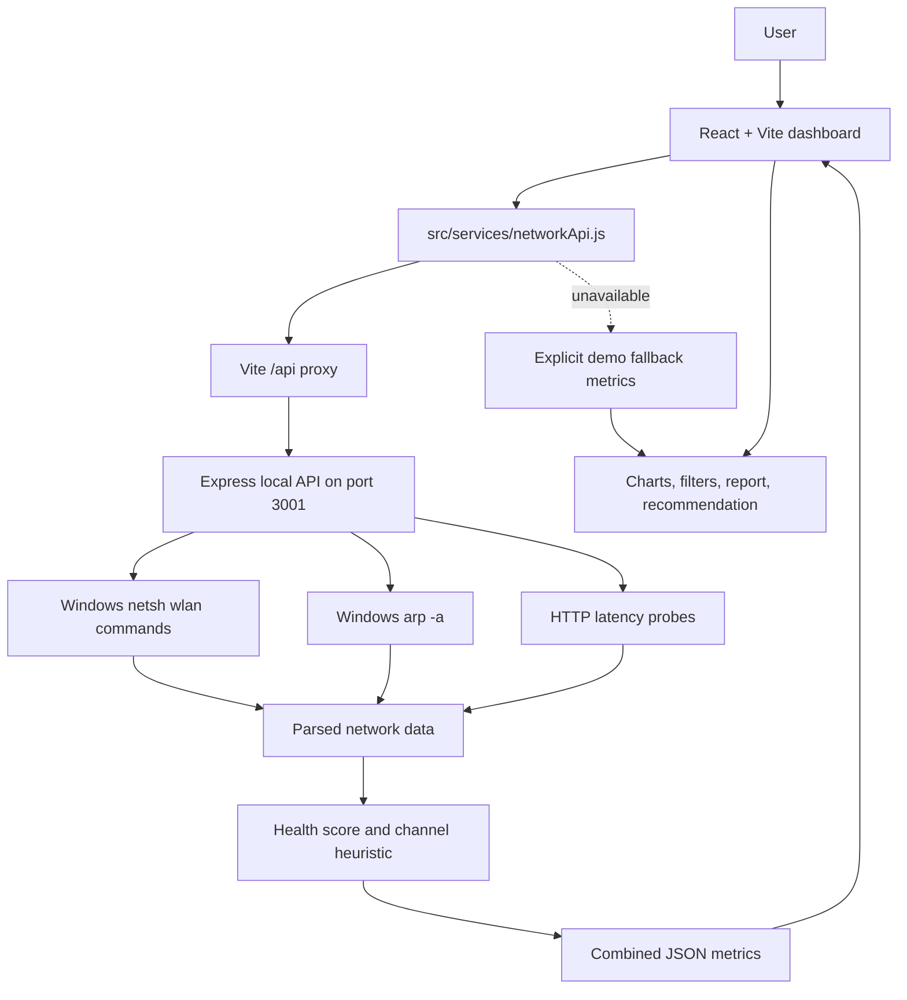

# AI-Based Wi-Fi Network Optimization

[](https://react.dev/)
[](https://vite.dev/)
[](https://nodejs.org/)
[](https://expressjs.com/)

AI-Based Wi-Fi Network Optimization is a React dashboard with a local Windows API for inspecting Wi-Fi conditions, measuring network health, discovering nearby access points and local devices, and producing an explainable channel recommendation.

The dashboard uses live data when the local API is available. If the API cannot be reached or a Windows collection command fails, it clearly labels the displayed `FALLBACK_METRICS` as demo data.

## 📌 Overview

Wi-Fi performance can degrade because of weak signal, latency, packet loss, neighboring networks, and channel overlap. This project collects those conditions from a Windows computer and presents them in a responsive dashboard designed to support manual Wi-Fi optimization.

The Express backend reads Wi-Fi interface details and nearby networks through Windows `netsh wlan` commands, measures HTTP round-trip latency, and reads the local ARP table for device discovery. It converts command output into JSON, calculates a health score, and evaluates candidate channels with an explainable interference heuristic. The React frontend requests combined metrics, refreshes them in the background, and falls back to clearly marked demo values when the backend is unavailable.

This is an analysis and recommendation tool. It does not authenticate with a router, change router settings, use a database, or provide a cloud service.

## 🎯 Objectives

- Monitor Wi-Fi connection details such as signal, channel, radio type, and link rates.
- Measure basic network performance through latency and packet-loss samples.
- Discover nearby wireless networks and compare their channels and signal levels.
- Discover local devices visible in the Windows ARP table.
- Analyze direct channel occupancy and adjacent-channel overlap.
- Produce an explainable channel recommendation from collected network data.
- Calculate a bounded network health score from signal, latency, packet loss, and receive rate.
- Visualize current conditions, channel scores, nearby networks, devices, and trends.
- Provide optimization assistance without directly modifying router configuration.

## ✨ Features

### Live dashboard

- Backend availability check when the application loads.
- Live combined analysis through `GET /api/network/metrics`.
- Automatic background refresh every 30 seconds while the backend is available.
- Clearly labelled demo fallback mode when live collection is unavailable.
- Signal strength with dBm and Windows signal-percentage context.
- Receive and transmit link speeds in Mbps.
- Average latency in milliseconds and packet-loss percentage.
- Network health score with a progress indicator.
- Rolling Network Performance area chart for link speed and latency.
- Channel Analysis with active band/channel, congestion, candidate channels, and nearby-network counts.
- Explainable recommendation card with current channel, congestion, scored candidates, recommended channel, and reasons.
- Connected device discovery from ARP data, including IP, MAC, inferred display type, and active/static status.
- Search and filtering across nearby networks and discovered devices.
- Expandable nearby-network list.
- Network Analysis Report modal with connection data, metrics, channel recommendation, and nearby networks.
- Print / Save PDF action using the browser print dialog.
- Responsive layout with Lucide React icons and Recharts visualizations.

### Recommendation action

`Apply Recommendation` does not edit router settings. It displays a warning explaining that the user must sign in to the router administration panel and change the channel manually.

## 🖥️ Dashboard

The application opens directly to a single responsive dashboard.

- **Sidebar:** not implemented. Navigation is not split into multiple pages.
- **Header:** shows connection state, SSID and band when live data is available, search, backend status, last-updated time, `View Report`, and `Run Analysis`.
- **Status notices:** show when the backend is unreachable and explain that demo data is being displayed.
- **Network metrics:** shows signal strength, link speed, latency, packet loss, and network health.
- **Network Performance:** uses Recharts `AreaChart`, `Area`, axes, grid, tooltip, and a rolling chart history. Live mode uses collected values; fallback mode is labelled demo data.
- **AI Recommendation:** displays channel analysis, nearby-network count, interference scores, expected result, and a manual-configuration warning.
- **Channel Analysis:** displays the active channel and band, congestion, 2.4 GHz non-overlapping candidates or 5 GHz candidates, and expandable nearby networks.
- **Connected Devices:** displays ARP-discovered IP/MAC entries. In fallback mode, the UI labels the device list as demo data.
- **Report modal:** summarizes connection status, measured metrics, channel analysis, nearby networks, and the read-only limitation.

## 🏗️ System Architecture



## 🔄 How It Works

1. Vite loads the React dashboard.
2. The frontend calls `/api/network/status` to check whether the local backend is reachable.
3. If the backend is available, the dashboard runs a full analysis through `/api/network/metrics`; otherwise it loads clearly labelled fallback data.
4. The backend runs Wi-Fi interface collection, nearby-network scanning, latency sampling, and ARP discovery in parallel for the combined metrics request.
5. Parsers normalize Windows command output into connection, network, latency, and device objects.
6. The backend calculates a 0-100 health score and evaluates candidate channels when a connected interface and nearby networks are available.
7. The frontend updates the metric cards, rolling chart, channel analysis, recommendation, nearby networks, and devices.
8. While analysis runs, the dashboard shows staged collection messages. Background refreshes run every 30 seconds without the loading animation.
9. Users can search/filter data, expand nearby networks, view a report, and print/save the report.
10. Users can use the recommendation to make a manual change in their router administration panel. The application itself remains read-only.

## 🤖 AI/ML Component

There is **no trained machine-learning model, training dataset, preprocessing pipeline, neural network, or model inference runtime** in the current repository. The project uses an explainable, rule-based channel optimization heuristic. The UI phrase `AI channel interference analysis` describes this analysis flow; it does not represent a trained model.

The backend function `aiChannelOptimizer` works as follows:

1. Select candidate channels: `[1, 6, 11]` for 2.4 GHz, or `[36, 40, 44, 48, 149, 153, 157, 161]` for 5 GHz.
2. Group scanned neighboring networks by channel.
3. Apply a direct co-channel penalty based on network count and average signal magnitude.
4. Apply a distance-weighted adjacent-channel penalty for 2.4 GHz overlap within four channels.
5. Sort candidates by score and select the lowest-scoring channel.
6. Return the selected channel, scored candidates, reasons, current-channel congestion estimate, and estimated interference reduction.

The health calculation is also rule-based. It starts at 100 and applies threshold penalties for signal, latency, and packet loss, with a small receive-rate bonus for rates at or above 100 Mbps. The result is clamped to a 0-100 score.

```text
Windows Wi-Fi scan + latency + interface data
                    |
             Parse and normalize
                    |
        Channel occupancy and signal data
                    |
      Rule-based interference scoring
                    |
       Lowest-scoring channel selected
                    |
       JSON recommendation for display
```

## 📊 Network Metrics

| Metric | Description | Unit |
|---|---|---|
| Signal Strength | Parsed Windows signal converted to an approximate RSSI value | dBm |
| Signal Percentage | Original Windows signal value | % |
| Link Speed (Rx) | Receive link rate from the connected Wi-Fi interface | Mbps |
| Link Speed (Tx) | Transmit link rate from the connected Wi-Fi interface | Mbps |
| Latency Average | Average of four HTTP connectivity-check samples | ms |
| Latency Minimum / Maximum | Minimum and maximum successful sample values | ms |
| Packet Loss | Failed latency samples divided by total samples | % |
| Network Health | Rule-based score from signal, latency, packet loss, and receive rate | % / 100 |
| Active Channel | Current connected Wi-Fi channel | Channel number |
| Channel Congestion | Heuristic estimate derived from the current channel score | % |
| Nearby Networks | Count and details of scanned access points | Count, channel, dBm, band |
| Connected Devices | Entries parsed from the local ARP table | Count, IP, MAC |

If the backend or its collection commands are unavailable, the UI uses the explicit demo fallback object in `src/services/networkApi.js` and marks the data as fallback/demo data.

## 📡 Channel Optimization

The backend scans nearby networks with `netsh wlan show networks mode=bssid`. Each parsed network can include SSID, BSSID, channel, radio type, authentication, encryption, signal percentage, approximate dBm, and derived band.

For each candidate channel, the heuristic:

- Counts networks directly occupying that channel.
- Adds a direct co-channel penalty based on occupancy and average signal magnitude.
- Adds a weighted adjacent-channel penalty for 2.4 GHz channels within the configured overlap radius.
- Sorts candidates from lowest to highest interference score.
- Returns the lowest-scoring candidate as the recommendation.

The recommendation is calculated automatically as part of the metrics response. The dashboard presents it for user review and manual action.

**Router control limitation:** the application cannot change router configuration. The backend only performs read-only collection, and `Apply Recommendation` only displays instructions to change the channel manually in the router administration panel.

## 🔌 API / Backend

### Backend details

- **Technology:** Node.js with Express 4 and CORS middleware.
- **Default base URL:** `http://localhost:3001`.
- **Operating system:** Windows is required for the implemented `netsh` and `arp` collection commands.
- **Server command:** `npm run dev:server`.
- **Frontend proxy:** Vite forwards `/api` requests to `http://localhost:3001` during development.
- **Authentication:** none.
- **Persistence:** none; data is collected per request and is not stored in a database.

### Endpoints

| Method | Endpoint | Description |
|---|---|---|
| GET | `/api/network/status` | Returns whether a Wi-Fi interface is connected and basic connection metadata. |
| GET | `/api/network/interfaces` | Returns all parsed Wi-Fi interface details from `netsh wlan show interfaces`. |
| GET | `/api/network/wifi` | Returns the connected Wi-Fi SSID, BSSID, channel, signal, rates, radio type, authentication, and band. |
| GET | `/api/network/scan` | Scans and returns nearby Wi-Fi networks, channels, approximate signal values, and bands. |
| GET | `/api/network/latency` | Performs four HTTP latency samples and returns average, minimum, maximum, reachability, and packet loss. |
| GET | `/api/network/devices` | Parses the local ARP table and returns discovered IP/MAC entries. |
| GET | `/api/network/metrics` | Collects Wi-Fi, nearby-network, latency, and ARP data in parallel, then returns combined metrics, health, and channel recommendation data. |

All routes use `GET` and return JSON. Collection failures return an error status or an `ok: false` response with an error message and, where applicable, fallback indicators or empty collections. No endpoint changes router configuration.

Example shape of a successful combined response:

```json
{
  "ok": true,
  "isFallback": false,
  "timestamp": "2026-09-08T12:00:00.000Z",
  "connected": true,
  "ssid": "example-network",
  "band": "2.4 GHz",
  "radioType": "802.11ax",
  "signalDbm": -48,
  "signalPercent": 84,
  "rxRate": 92,
  "txRate": 72,
  "latency": {
    "avg": 18,
    "min": 14,
    "max": 24,
    "packetLoss": 0,
    "samples": 4,
    "reachable": true
  },
  "healthScore": 94,
  "currentChannel": 6,
  "nearbyNetworks": [],
  "nearbyCount": 0,
  "aiRecommendation": null,
  "devices": [],
  "deviceCount": 0
}
```

The values in this example describe the response shape only and are not claimed performance results.

## 🧩 Technology Stack

| Layer | Technology |
|---|---|
| Frontend | React 19, React DOM |
| Styling | Tailwind CSS 3, PostCSS, Autoprefixer |
| Charts | Recharts |
| Icons | Lucide React |
| Backend | Node.js, Express 4, CORS |
| AI/ML | Rule-based channel interference heuristic and threshold-based health scoring; no trained ML model |
| Data Collection | Windows `netsh wlan` commands, Windows `arp -a`, and HTTP/S latency probes |
| Build Tool | Vite 8 with `@vitejs/plugin-react` |
| Linting | Oxlint |

## 🚀 Setup and Usage

### Prerequisites

- Node.js and npm.
- Windows for the live collection backend.
- A Wi-Fi adapter and network connection if live interface and scan data are desired.

No environment file or environment variables are required by the current implementation.

### Install dependencies

```bash
npm install
```

### Run frontend and backend together

```bash
npm run dev:all
```

This starts the Express API and Vite development server concurrently. Open the Vite URL shown in the terminal, normally `http://localhost:5173`.

### Run separately

Frontend only:

```bash
npm run dev
```

Backend only:

```bash
npm run dev:server
```

The API listens on `http://localhost:3001`.

### Verify the project

```bash
npm run lint
npm run build
```

`npm run lint` currently reports warnings for unused variables in the existing implementation but completes successfully. The production build completes successfully; Vite may report a chunk-size warning for the generated JavaScript bundle.

### Preview a production build

```bash
npm run preview
```

## 📁 Project Structure

```text
AI-Based-Wi-Fi-Network-Optimization/
├── public/
│   ├── favicon.svg
│   └── icons.svg
├── server/
│   └── index.js                 # Express API, Windows collectors, parsers, heuristics
├── src/
│   ├── assets/
│   │   ├── hero.png
│   │   ├── react.svg
│   │   └── vite.svg
│   ├── services/
│   │   └── networkApi.js        # API client and explicit demo fallback metrics
│   ├── App.jsx                  # Live dashboard, polling, report, filtering, and UI state
│   ├── App.css                  # Remaining component stylesheet
│   ├── index.css                # Tailwind directives and global styles
│   └── main.jsx                 # React entry point
├── .gitignore
├── .oxlintrc.json
├── index.html
├── package.json
├── package-lock.json
├── postcss.config.js
├── tailwind.config.js
├── vite.config.js
└── README.md
```

## ⚠️ Current Scope and Limitations

- Live collection depends on Windows `netsh` and `arp` commands and local network reachability.
- The dashboard falls back to explicitly labelled demo metrics when the backend is unavailable.
- Approximate dBm values are derived from Windows signal percentages using the implemented conversion; they are not independently calibrated measurements.
- Device discovery is based on the local ARP table. It does not provide traffic accounting, device names from a database, or guaranteed complete device inventory.
- Latency and packet loss represent the four configured HTTP connectivity-check samples, not a full network benchmark.
- There is no trained ML model, dataset, authentication, database, cloud deployment, router integration, or automatic router reconfiguration.
- Channel recommendations require manual changes in the router administration interface.

## 📄 License

No license file is currently included in this repository.
